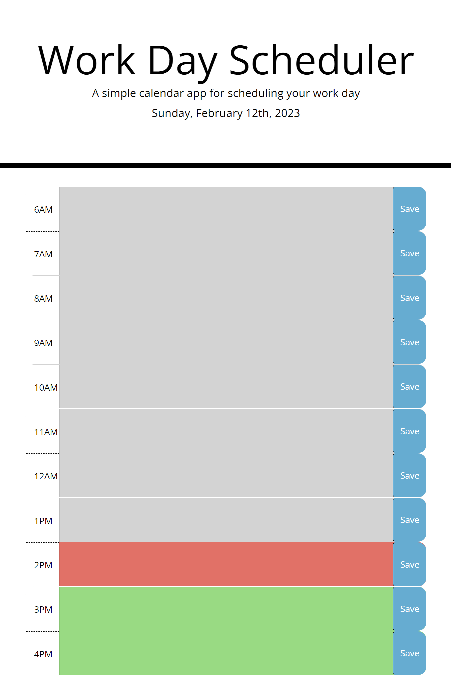

# Work Day Scheduler

## Description

The motivation of creating a WorkDay scheduler is for the user to indicate the current time of day. With the colors clearly indicating the time of the day, tasks can be added and save to view throughout the day. This saves having to remember tasks that was due by certain time of the day.

## Installation

Starter code was provided by [Coding Boot Camp Repo](#https://github.com/coding-boot-camp/super-disco)

## Usage

- Present day is shown
- Daily refreshes to current date
- Throughout theday user are able to input tasks and save input.

# Features
- When page is opened it will present current day
- Gray areas indicated times passed
- Red present current hour
- Green what is left of the day

## Credits

Starter code was needed and provided by: [Coding Boot Camp Repo](#https://github.com/coding-boot-camp/super-disco)

## License

MIT License

Copyright (c) 2023 Lely Huynh

Permission is hereby granted, free of charge, to any person obtaining a copy
of this software and associated documentation files (the "Software"), to deal
in the Software without restriction, including without limitation the rights
to use, copy, modify, merge, publish, distribute, sublicense, and/or sell
copies of the Software, and to permit persons to whom the Software is
furnished to do so, subject to the following conditions:

The above copyright notice and this permission notice shall be included in all
copies or substantial portions of the Software.

THE SOFTWARE IS PROVIDED "AS IS", WITHOUT WARRANTY OF ANY KIND, EXPRESS OR
IMPLIED, INCLUDING BUT NOT LIMITED TO THE WARRANTIES OF MERCHANTABILITY,
FITNESS FOR A PARTICULAR PURPOSE AND NONINFRINGEMENT. IN NO EVENT SHALL THE
AUTHORS OR COPYRIGHT HOLDERS BE LIABLE FOR ANY CLAIM, DAMAGES OR OTHER
LIABILITY, WHETHER IN AN ACTION OF CONTRACT, TORT OR OTHERWISE, ARISING FROM,
OUT OF OR IN CONNECTION WITH THE SOFTWARE OR THE USE OR OTHER DEALINGS IN THE
SOFTWARE.

